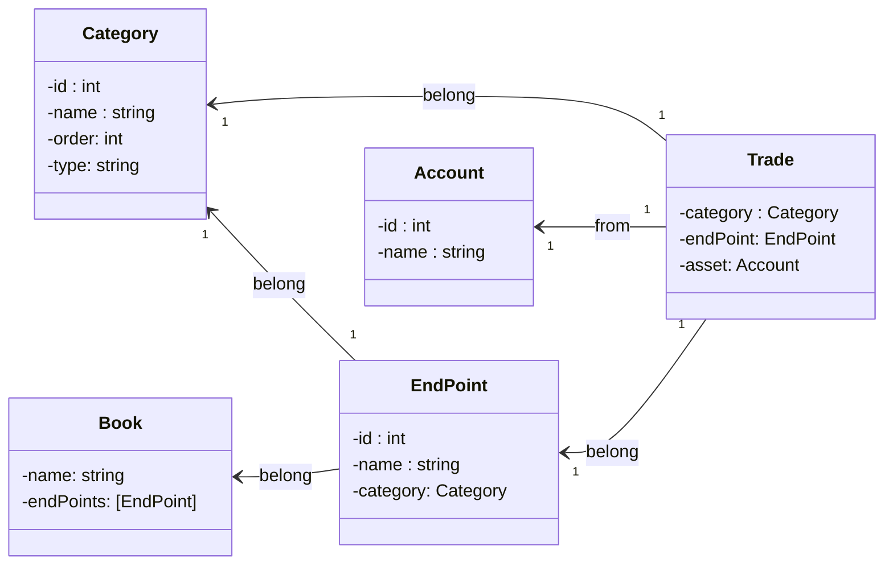

# 一个记账 App

> 好想能发布一个自己的 App 到 App Store。

一直以来都有这么一个想法，为了能让自己做下去，选择一个比较如果想明白，结构也简单的 App。

`Tally` 一个记账 App。

## 结构

### 名词定义

1. **交易(Trade)**：每一次的花费
2. **类别(Catrgory)**：交易所属的类别，如：支出-早餐
3. **预算(Budge)**：每个类别可以定义自己的预算
4. **项目(Subject)**：某个事件的一系列交易，如：旅行、装修
5. **账户(Account)**：一般属于个人的资金存放处，如：银行卡
6. **账本(Book)**：区别记账范围，如：公司记账、采购记账

### 关系

